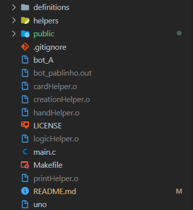
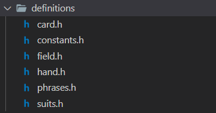

<div align="center" id="top"> 
  
  &#xa0;
</div>

<h1 align="center">Introdução às técnicas de programação - UNO</h1>
<h2 align="right">Pablo Deyvid de Paiva</h2>
<br>

<p align="center">
  <a href="#dart-sobre">Sobre</a> &#xa0; | &#xa0; 
  <a href="#sparkles-estrutura-do-código">Estrutura</a> &#xa0; | &#xa0;
  <a href="#sparkles-main">main.c</a> &#xa0; | &#xa0;
  <a href="#rocket-definitions">Definitions</a> &#xa0; | &#xa0;
  <a href="#joystick-helpers">Helpers</a> &#xa0; | &#xa0;
  <a href="#hammer-makefile">Makefile</a> &#xa0; | &#xa0;
  <a href="#memo-license">License</a> &#xa0; | &#xa0;
  <a href="https://github.com/ITP-UFRN/UNO" target="_blank">GitHub</a>
</p>

<br>

## :dart: Sobre ##

Projeto prático apresentado à disciplina de Introdução às Técnicas de Programação do Bacharelado em Tecnologia da Informação da Universidade Federal do Rio Grande do Norte. Orientado pelo Prof. Dr. André Mauricio Campos.

O projeto tem como objetivo o desenvolvimento de um Bot em C capaz de jogar o jogo UNO.

## :sparkles: Estrutura do código ##

A estrutura basica do código conta com um arquivo principal main.c, as subpastas definitions e helpers. Além dos arquivos de compilação e de configuração.



A pasta definitions conta com os arquivos de definição .h que definem constantes, enums e structs.



<br>
Já a pasta helpers conta com arquivos que possuem a lógica do bot e seus arquivos de cabeçalho.

## :sparkles: main ##

O arquivo main.c inicialmente importa todas as dependências necessárias para sua execução.
```c
#include <stdio.h>
#include <stdlib.h>
#include <string.h>

#include "./definitions/constants.h"
#include "./definitions/suits.h"

#include "./helpers/handHelper.h"
#include "./helpers/printHelper.h"
#include "./helpers/creationHelper.h"
#include "./helpers/logicHelper.h"
```

Iniciando o código, os arquivos stdin, stdout e stderr tem seus buffer setados como NULL.
Logo após, é feita a definição das variáveis que guardarão o id do bot, os players, a mão em formato de string e a carta inicial do jogo em formato de string.

As primeiras leituras feitas são a dos players e o do id do bot.

Depois, a mão em formato de string é lida e convertida em um objeto do tipo HAND com o método createHand().

Logo após, a carta que representará a carta em cima da mesa é criada a partir da leitura de sua representação em string.

Em seguida, é criada a variável que representará a ação e também a o complemento da ação de outro jogador.

```c
int main()
{
    setbuf(stdin, NULL);
    setbuf(stdout, NULL);
    setbuf(stderr, NULL);

    char *myself = calloc(MAX_ID_SIZE, sizeof(char));
    char players[MAX_LINE];
    char handString[MAX_LINE];
    char initialTopTableString[MAX_LINE];

    scanf("PLAYERS %[^\n]\n", players);
    scanf("YOU %s\n", myself);

    scanf("HAND %[^\n]\n", handString);
    HAND *hand = createHand(handString);

    scanf("TABLE %s\n", initialTopTableString);
    CARD *topTable = createCard(initialTopTableString);

    char action[MAX_ACTION];
    char complement[MAX_LINE];
```
Por fim, a partida é iniciada. Dentro de um while infinito é lida a ação dos outros jogadores e depois é feita a ação do próprio bot.
```c
    while (1)
    {
        do
        {
            scanf("%s %s", action, complement);
            actionAnotherPlayer(action, topTable, complement);
        } while (strcmp(action, "TURN") || strcmp(complement, myself));
        myAction(topTable, hand);
    }

    return 0;
}
```

## :rocket: Definitions ##

## card.h
O primeiro arquivo de definição é o card.h, nele é contido a definição básica de uma carta, contendo o seu valor completo (número e naipe), além dos próprios número e naipe separados.
```h
#ifndef _CARD_
#define _CARD_
typedef struct{
    char *value;
    char *number;
    char *suit;
} CARD;
#endif
```

## constants.h
O arquivo constants.h contém a definição básica das constantes padrão do sistema já entregue pelo professor.
```h
#ifndef MAX_LINE
#define MAX_LINE 100
#endif

#ifndef MAX_ACTION
#define MAX_ACTION 10
#endif

#ifndef MAX_ID_SIZE
#define MAX_ID_SIZE 10
#endif
```

## field.h
O arquivo field.h conta com a definição de um enum que define os campos de uma carta.
```h
#ifndef _FIELDS_
#define _FIELDS_
typedef enum {
    VALUE,
    VALUE_OR,
    VALUE_AND,
    NUMBER,
    SUIT
} FIELD;
#endif
```

## hand.h
O arquivo hand.h define uma struct que representa uma mão (HAND), onde contém um array de ponteiros para CARD e um inteiro que representa a quantidade de cartas.
```h
#include "./card.h"

#ifndef _HAND_
#define _HAND_
typedef struct{
    CARD **cards;
    int amountCards;
} HAND;
#endif
```

## phrases.h
O arquivo phrases.h define frases aleatórias do filme O alto da Compadecida.
```h
#ifndef _PHRASES_
#define _PHRASES_
char *PHRASES[] = {
    "Não sei, só sei que foi assim!",
    "Matar padre dá um azar danado. Sobretudo para o padre.",
    "Valha-me Nossa Senhora, Mãe de Deus de Nazaré! A vaca mansa dá leite, a braba dá quando quer.",
    "Fui logo dizendo “I love you”, e ela se derreteu todinha. Quer dizer “morena” em francês.",
    "⁠Ô, promessa desgraçada. Ô, promessa sem jeito!",
    "Depois que morre, todo mundo fica bonzinho!",
    "O inferno vai terminar como disse Murilo: feito repartição pública, que existe, mas não funciona.",
    "Tá aí duas coisas que eu não sabia: uma que eu era corno, outra que defunto falava.",
    "Trair você era lhe matar um pouquinho dentro do meu coração.",
    "Já fui menino, fui homem, só me falta ser mulher."
};
#endif
```

## suits.h
Arquivo que define constantes que representam os naipes.
```h
#ifndef HEARTS_U
#define HEARTS_U "♥"
#endif

#ifndef DIAMONDS_U
#define DIAMONDS_U "♦"
#endif

#ifndef CLUBS_U
#define CLUBS_U "♣"
#endif

#ifndef SPADES_U
#define SPADES_U "♠"
#endif
```

## :joystick: Helpers ##

## printHelper

O primeiro e mais simples helper é o printHelper, onde o cabeçalho expõe apenas o método debug():
```h
void debug(char *);
```
O arquivo printHelper.c contém a implementação do método debug() já disponibilizado pelo professor, possuindo como parâmetro uma string que será impressa no stderr e sem retorno.
```c
#include <stdio.h>

void debug(char *message)
{
    fprintf(stderr, "%s\n", message);
}
```
## cardHelper

O cardHelper.h expõe três métodos de comparação de cartas. O método cardIsEquals() compara o valor da carta (número e naipe), o cardIsEqualsNumber() compara o número e o cardIsEqualsSuit() o naipe.

```h
#include "../definitions/card.h"
#include "../definitions/hand.h"

int cardIsEquals(CARD *, CARD *);
int cardIsEqualsNumber(CARD *, CARD *);
int cardIsEqualsSuit(CARD *, CARD *);
```

Todos os três métodos recebem duas cartas para serem comparadas e retornar um inteiro, onde o valor 1 representa true e o valor 0 false.

```c
#include <string.h>

#include "../definitions/card.h"
#include "../definitions/hand.h"

int cardIsEquals(CARD *c1, CARD *c2)
{
    return (strcmp(c1->number, c2->number) == 0 && strcmp(c1->suit, c2->suit) == 0) ? 1 : 0;
}

int cardIsEqualsNumber(CARD *c1, CARD *c2)
{
    return (strcmp(c1->number, c2->number) == 0) ? 1 : 0;
}

int cardIsEqualsSuit(CARD *c1, CARD *c2)
{
    return (strcmp(c1->suit, c2->suit) == 0) ? 1 : 0;
}
```

## handHelper

O handHelper é responsável por conter métodos que auxiliam variáveis do tipo HAND, contendo o método addToHand() que adiciona uma CARD na HAND e o método removeFromHand() que remove uma CARD da HAND.

```h
#include "../definitions/card.h"
#include "../definitions/hand.h"

void addToHand(HAND *, CARD *);
void removeFromHand(HAND *hand, CARD *card);
```

Primeiro, o método addToHand() não tem retorno e recebe um ponteiro para uma HAND e outro para uma CARD.

As CARDS presente na HAND recebida sofre uma realocação do seu tamanho + 1. O ponteiro presente na última posição recebe uma nova CARD a partir da CARD recebida e o AMOUNTCARD é incrementado.

```c
void addToHand(HAND *hand, CARD *card)
{
    hand->cards = realloc(hand->cards, (hand->amountCards + 1) * sizeof(CARD *));
    hand->cards[hand->amountCards] = createCard(card->value);
    hand->amountCards = hand->amountCards + 1;
}
```

O método removeFromHand() presente no handHelper também não tem retorno e recebe como parâmetro um ponteiro para uma HAND e um ponteiro para uma CARD.

Primeiro, caso a CARD não esteja presente na HAND o método é encerrado alí mesmo. Caso só haja uma CARD na HAND, o AMOUNTCARD é zerado, a memória do array de CARD é liberado e realocado para o tamanho 0.


Por fim, para os demais casos, a CARD a ser removida é colocada para o final do array e é liberada a memória da posição, no final, realocado o tamanho do array -1.

```c
void removeFromHand(HAND *hand, CARD *card)
{
    int index = indexOf(hand, card);
    if (index == -1)
        return;

    if (index == 0 && hand->amountCards == 1)
    {
        hand->amountCards = 0;
        free(hand->cards[0]);
        hand->cards = calloc(0, sizeof(CARD *));
        return;
    }

    for (int i = index; i < hand->amountCards - 1; i++)
    {
        CARD *aux = hand->cards[i];
        *(hand->cards[i]) = *(hand->cards[i + 1]);
        *(hand->cards[i + 1]) = *aux;
    }

    free(hand->cards[hand->amountCards - 1]);
    hand->cards = realloc(hand->cards, (hand->amountCards - 1) * sizeof(CARD *));
    hand->amountCards = hand->amountCards - 1;
}
```

O método auxiliar indexOf() recebe uma CARD a ser encontrada em uma HAND também recebida, retornando seu index.

```c
int indexOf(HAND *hand, CARD *card)
{
    for (int i = 0; i < hand->amountCards; i++)
    {
        if (strcmp(hand->cards[i]->number, card->number) == 0 && strcmp(hand->cards[i]->suit, card->suit) == 0)
        {
            return i;
        }
    }
    return -1;
}
```

## creationHelper

O creationHelper possui os métodos responsáveis por criar variáveis do tipo CARD e HAND. 

```h
#include "../definitions/card.h"
#include "../definitions/hand.h"

CARD *createCard(char *);
HAND *createHand(char *);
```

O método crateCard() é responsável por criar uma variável do tipo CARD a partir de uma string no formato: [NUMERO][NAIPE] recebida como parâmetro.
Inicialmente é alocado um ponteiro para CARD de tamanho 1 * o tamanho da CARD. Depois, é alocado 10 posições de tamanho de char para o campo VALUE presente na CARD e o valor da carta passada como parâmetro é copiado com o método strcpy();

O próximo passo é separar o número do naipe. O campo NUMBER e SUIT da CARD é alocado o mesmo tamanho do VALUE, e é copiada uma substring do início do value até a segunda posição (no caso do 10) ou até a primeira posição (os outros casos).

Já o naipe da carta se inicia da posição 2 (no caso do número ser 10) ou na posição 1 (no restante dos casos para número) até o final da string presente no VALUE.

Por fim, a CARD alocada é retornada.
```c
CARD *createCard(char *cardString)
{
    CARD *c = calloc(1, sizeof(CARD));
    c->value = calloc(10, sizeof(char));
    strcpy(c->value, cardString);

    int initSub = 0;
    if (c->value[0] == '1')
    {
        c->number = calloc(strlen(c->value), sizeof(char));
        strncpy(c->number, c->value, 2);
        initSub = 2;
    }
    else
    {
        c->number = calloc(strlen(c->value), sizeof(char));
        strncpy(c->number, c->value, 1);
        initSub = 1;
    }

    c->suit = calloc(strlen(c->value), sizeof(char));
    strncpy(c->suit, c->value + initSub, strlen(c->value));

    return c;
}
```

O outro método presente no creationHelper é o createHand() que recebe uma string com a mão do jogador. Onde existem colchetes nas extremidades e as cartas são separadas por espaços.

O primeiro passo é alocar um ponteiro para HAND de tamanho 1 * o tamanho de HAND. Depois, o array de cartas presente na HAND é iniciado vazio e o AMOUNTCARDS é iniciado com 0.

Uma técnica conhecida como split, que consiste em criar substrings a partir de um delimitador e de outra string. O método utilizado para isso é o strtok() e o delimitador é um espaço vazio " ".

Cada substring representa uma carta e é adicionada a HAND com auxílio do addHand().

Por fim, é retornado o ponteiro da HAND alocada. 
```c
HAND *createHand(char *handString)
{
    HAND *h = calloc(1, sizeof(HAND));
    h->cards = calloc(0, sizeof(CARD *));
    h->amountCards = 0;

    char delim[] = " ";
    char *split = strtok(handString, delim);

    while (split != NULL)
    {
        if (split[0] != '[' && split[0] != ']')
        {
            CARD *c = createCard(split);
            addToHand(h, c);
        }
        split = strtok(NULL, delim);
    }

    return h;
}
```

## logicHelper

O arquivo logicHelper contém as principais funções responsáveis pela lógica do bot.

```h
#include "../definitions/card.h"
#include "../definitions/hand.h"

CARD *chooseBestCard(CARD *topCard, HAND *hand);
void actionAnotherPlayer(char *, CARD *, char *);
void myAction(CARD *, HAND *);
```

Um dos principais métodos é o chooseBestCard(), que retorna um ponteiro para uma CARD e recebe como parâmetro um ponteiro para CARD representando a CARD no topo da mesa e um ponteiro para a HAND do jogador.

A lógica inicial é jogar todas as cartas de ação primeiro, para que os outros jogadores comprem mais cartas.
Incialmente, é procurada cartas do tipo Valete, depois Coringa e em seguida Rei, se encontrada, a carta é retornada e retirada da HAND.
Caso nenhuma dessas cartas de ação estejam presentes na HAND, qualquer carta que tenha o número ou naipe iguais a carta de topo da mesa é retornada.

Caso, mesmo assim, nenhuma carta seja encontrada, é procurado alguma carta Ás na HAND, caso encontrada, é retornada, caso não o método retorna NULL.

```c
CARD *chooseBestCard(CARD *topCard, HAND *hand)
{
    // Find any valete
    int i = getIndexCardBy(VALUE_AND, topCard->suit, "V", hand);
    if (i != -1)
    {
        CARD *choice = createCard(hand->cards[i]->value);
        removeFromHand(hand, hand->cards[i]);
        return choice;
    }
    // Find any Coringa
    i = getIndexCardBy(NUMBER, "", "C", hand);
    if (i != -1)
    {
        CARD *choice = createCard(hand->cards[i]->value);
        removeFromHand(hand, hand->cards[i]);
        return choice;
    }
    // Find any Rei

    i = getIndexCardBy(VALUE_AND, topCard->suit, "R", hand);
    if (i != -1)
    {
        CARD *choice = createCard(hand->cards[i]->value);
        removeFromHand(hand, hand->cards[i]);
        return choice;
    }
    // Find any
    i = getIndexCardBy(VALUE_OR, topCard->suit, topCard->number, hand);
    if (i != -1)
    {
        CARD *choice = createCard(hand->cards[i]->value);
        removeFromHand(hand, hand->cards[i]);
        return choice;
    }
    // Find any ÁS
    i = getIndexCardBy(NUMBER, "", "A", hand);
    if (i != -1)
    {
        CARD *choice = createCard(hand->cards[i]->value);
        removeFromHand(hand, hand->cards[i]);
        return choice;
    }
    return NULL;
}
```

O método actionAnotherPlayer() é executado quando outro jogados está jogando. Sem retorno, o método recebe uma string com a ação do jogador, um ponteiro para CARD representando a carta em cima da mesa e uma string com o complemento da jogada.

Caso a jogada seja BUY e a carta em cima da mesa seja valete ou coringa, o número da carta é alterado para o valor "X", indicando que outro jogador já comprou as cartas refetente a jogada.

Caso o outro jogador tenha jogado um DISCARD, é feita uma validação para saber se a jogada é válida, caso não, o método é encerrado.

Com a jogada válida, a carta em cima da mesa é trocada para a carta que foi jogada. Caso a carta seja um coringa ou um Ás, é lido o segundo complemento representando o novo valor para o naipe e setado na atual carta do topo da mesa.

```c
void actionAnotherPlayer(char *action, CARD *topTable, char *complement)
{
    if (strcmp(action, "BUY") == 0 && (strcmp(topTable->number, "V") == 0 || strcmp(topTable->number, "C") == 0))
    {
        strcpy(topTable->number, "X");
        return;
    }

    if (strcmp(action, "DISCARD") == 0)
    {
        CARD *new = createCard(complement);
        if (!cardIsEqualsSuit(new, topTable) && !cardIsEqualsNumber(new, topTable) && !strcmp(new->number, "C") && !strcmp(new->number, "A"))
        {
            return;
        }

        *topTable = *new;

        if (strcmp(topTable->number, "C") == 0 || strcmp(topTable->number, "A") == 0)
        {
            char complement2[MAX_LINE];
            scanf(" %s", complement2);
            topTable->suit = complement2;
        }
    }
```

A ação do jogador do bot é feita com auxílio do método sem retorno chamado myAction(), que recebe um ponteiro para uma CARD que representa a carta em cima da mesa e um ponteiro para a HAND do jogador.

Caso a carta em cima da mesa sejá um valete é comprada 2 cartas, caso seja um coringa, é comprada 4.

O método continua caso as etapas anteriores não sejam executadas. 
Um ponteiro para uma CARD é gerado a partir da chamada do método chooseBestCard.

Caso o ponteiro seja NULL, é comprada uma carta e o método é encerrado.
Caso o ponteiro aponte para uma CARD com número igual a "C" ou "A", é chamado o método auxiliar chooseBestSuit() para pegar o melhor naipe para ser trocado.
No fim, a carta é descartada.

```c
void myAction(CARD *topTable, HAND *hand)
{
    if ((rand() % 100) < 50)
    {
        printf("SAY %s\n", PHRASES[rand() % 9]);
    }

    if (strcmp(topTable->number, "V") == 0)
    {
        char cardString1[MAX_LINE];
        char cardString2[MAX_LINE];
        printf("BUY 2\n");
        scanf("%s %s\n", cardString1, cardString2);

        CARD *more1 = createCard(cardString1);
        CARD *more2 = createCard(cardString2);

        addToHand(hand, more1);
        addToHand(hand, more2);
        return;
    }
    else if (strcmp(topTable->number, "C") == 0)
    {
        char cardString1[MAX_LINE];
        char cardString2[MAX_LINE];
        char cardString3[MAX_LINE];
        char cardString4[MAX_LINE];
        printf("BUY 4\n");
        scanf("%s %s %s %s\n", cardString1, cardString2, cardString3, cardString4);

        CARD *more1 = createCard(cardString1);
        CARD *more2 = createCard(cardString2);
        CARD *more3 = createCard(cardString3);
        CARD *more4 = createCard(cardString4);

        addToHand(hand, more1);
        addToHand(hand, more2);
        addToHand(hand, more3);
        addToHand(hand, more4);
        return;
    }

    CARD *choice = chooseBestCard(topTable, hand);

    if (choice == NULL)
    {
        printf("BUY 1\n");
        char cardString[MAX_LINE];
        scanf("%s\n", cardString);
        CARD *more = createCard(cardString);
        addToHand(hand, more);
    }
    else
    {
        if (hand->amountCards == 0)
        {
            printf("SAY UNOOO!!!\n");
        }
        if (strcmp(choice->number, "C") == 0 || strcmp(choice->number, "A") == 0)
        {
            char *bestSuit = chooseBestSuit(hand);
            strcpy(topTable->suit, bestSuit);
            printf("DISCARD %s%s %s\n", choice->number, choice->suit, bestSuit);
        }
        else
        {
            printf("DISCARD %s%s\n", choice->number, choice->suit);
        }
    }
}
```

O método auxilia quantSuitInHand() retorna um inteiro que representa a quantidade de cartas do naipe passado como parâmetro presente na HAND também passada como parâmetro.

```c
int quantSuitInHand(HAND *hand, char *suit)
{
    int cont = 0;
    for (int i = 0; i < hand->amountCards; i++)
    {
        if (strcmp(suit, hand->cards[i]->suit) == 0 && strcmp("C", hand->cards[i]->number) != 0 && strcmp("A", hand->cards[i]->number) != 0)
        {
            cont++;
        }
    }
    return cont;
}
```

O método chooseBestSuit retorna o melhor naipe (mais quantitativo) para ser trocado, recebendo a HAND do jogador com o auxílio do quantSuitInHand();

```c
char *chooseBestSuit(HAND *hand)
{
    char *suit = calloc(10, sizeof(char));
    strcpy(suit, hand->cards[0]->suit);

    int amountHearts = quantSuitInHand(hand, HEARTS_U);
    int amountDiamonds = quantSuitInHand(hand, DIAMONDS_U);
    int amountClubs = quantSuitInHand(hand, CLUBS_U);
    int amountSpades = quantSuitInHand(hand, SPADES_U);

    int amounts[] = {amountHearts, amountDiamonds, amountClubs, amountSpades};

    int index = 0;

    for (int i = 0; i < 4; i++)
        if (amounts[i] > amounts[index])
            index = i;

    switch (index)
    {
    case 0:
        return HEARTS_U;
    case 1:
        return DIAMONDS_U;
    case 2:
        return CLUBS_U;
    case 3:
        return SPADES_U;
    default:
        return HEARTS_U;
    }
}
```

Por fim, o último método auxiliar do logicHelper, o getIndexCardBy() retorna o index de uma carta que corresponda a alguns requisitos passados como parâmetros.
Primeiro, é recebido um ponteiro para um FIELD, representando o tipo de comparação que o método vai fazer (supracitado). Depois, duas strings com o valor do naipe e do número a ser comparado. Por fim, a HAND do jogador.

```c
int getIndexCardBy(FIELD f, char *stringSuit, char *stringNumber, HAND *hand)
{
    for (int i = 0; i < hand->amountCards; i++)
    {
        switch (f)
        {
        case VALUE_OR:
            if (strcmp(hand->cards[i]->number, stringNumber) == 0 || strcmp(hand->cards[i]->suit, stringSuit) == 0)
            {
                return i;
            }
            break;
        case VALUE_AND:
            if (strcmp(hand->cards[i]->number, stringNumber) == 0 && strcmp(hand->cards[i]->suit, stringSuit) == 0)
            {
                return i;
            }
            break;
        case NUMBER:
            if (strcmp(hand->cards[i]->number, stringNumber) == 0)
            {
                return i;
            }
            break;
        case SUIT:
            if (strcmp(hand->cards[i]->suit, stringSuit) == 0)
            {
                return i;
            }
            break;
        default:
            break;
        }
    }

    return -1;
}
```

## :hammer: Makefile ##

O arquivo Makefile é responsável por compilar o projeto parte por parte.

```makefile
all: main.c _creation_helper _print_helper _card_helper _hand_helper _logic_helper
	gcc main.c creationHelper.o printHelper.o cardHelper.o handHelper.o logicHelper.o -o Pablo.bot
_creation_helper: helpers/creationHelper.c 
	gcc helpers/creationHelper.c -c
_print_helper: helpers/printHelper.c 
	gcc helpers/printHelper.c -c
_card_helper: helpers/cardHelper.c
	gcc helpers/cardHelper.c -c
_hand_helper: helpers/handHelper.c
	gcc helpers/handHelper.c -c
_logic_helper: helpers/logicHelper.c
	gcc helpers/logicHelper.c -c
```

Para compilar o projeto, é necessário rodar o seguinte comando:

```shell
$ make all
```

Gerando assim, o arquivo compilado <b>Pablo.bot</b>.

## :memo: License ##

This project is under license from GLP. For more details, see the [LICENSE](LICENSE.md) file.


Feito com ❤️ por <a href="https://github.com/pablodeyvid11" target="_blank">Pablo Deyvid</a>
&#xa0;

<a href="#top">Voltar ao início</a>
